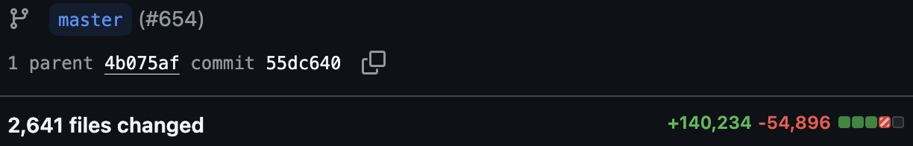
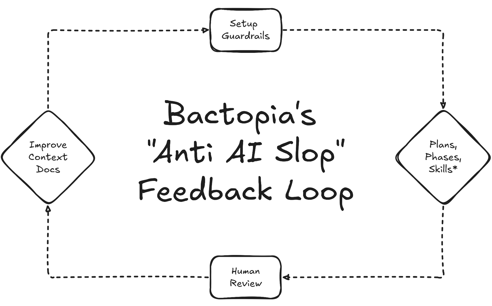
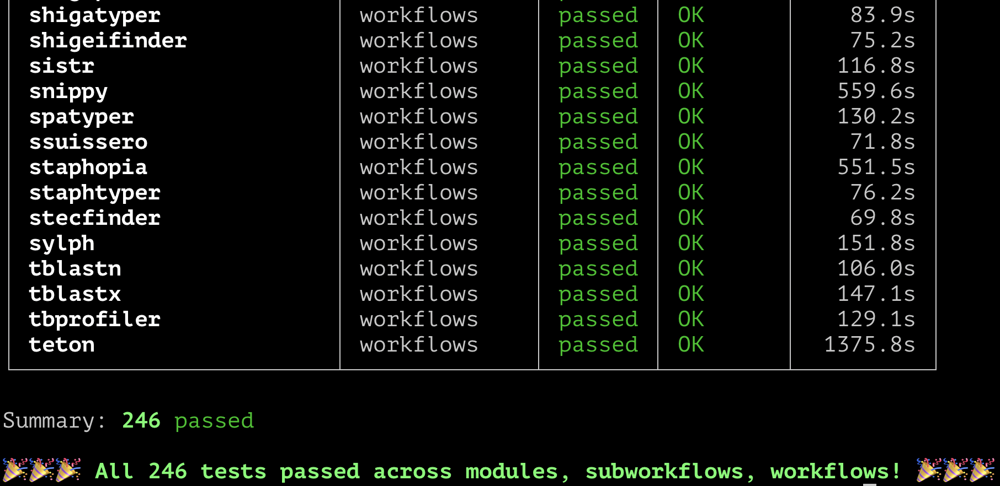

Olá pessoal! Aqui é o Robert, desenvolvedor do Bactopia! Já faz um tempinho, né? Mas finalmente chegou! Estou muito animado em anunciar o [lançamento da versão 4 do Bactopia](https://github.com/bactopia/bactopia/releases/tag/v4.0.0)!

Você deve estar se perguntando o que há de novo no Bactopia? E a resposta é **_muita coisa_**, mas também… **_não muita coisa_**, mas no bom sentido! Como isso é possível? Bem, sobre isso…

## O Bactopia agora é todo Strict, Static e Records!

Ao longo do último ano, o [Nextflow](https://nextflow.io/) (o motor no qual o Bactopia é baseado) passou por uma significativa metamorfose, com a [introdução de Strict Syntax e Static Types na v25](https://seqera.io/blog/nextflow-25-10-plugin-registry/), e [agora Record Types na v26](https://github.com/nextflow-io/nextflow/releases/tag/v26.04.0). Haha, se você já olhou o código-fonte do Bactopia, rapidamente perceberia que ele era a coisa menos "strict" possível. O Bactopia tirava proveito de muitas coisas no Nextflow que não eram realmente o propósito pretendido (por exemplo, [executar mais de 60 workflows a partir de um único workflow…](https://github.com/bactopia/bactopia/blob/4b075af96da522222bb075d4b65927d1ba3de9c2/workflows/bactopia-tools.nf)).

Então, para responder à sua primeira pergunta: _como o Bactopia mudou muito, sem mudar muito?_

Bem, para implementar strict syntax, static types e record types, eu precisei essencialmente reescrever o código-fonte, quase do zero (_o que, de novo, não é necessariamente uma coisa ruim!_). Como você pode ver na imagem abaixo, a v4 do Bactopia alterou 2.641 arquivos, com 140 mil linhas de código adicionadas e 55 mil linhas removidas. É verdade! Confira o [CHANGELOG](https://github.com/bactopia/bactopia/blob/master/CHANGELOG.md#v400-bactopiabactopia-cream-puff-20260429)!

Na versão 4 do Bactopia, fico feliz em informar que agora estou em conformidade com o futuro do Nextflow! O que, como efeito colateral, significa que o Bactopia agora deve funcionar muito melhor tanto localmente quanto na nuvem.

Embora Strict Syntax, Static Types e Record Types não sejam exatamente "obrigatórios", acredito que sua adoção colocou o Bactopia em um lugar muito melhor do que estava antes. Um brinde ao pessoal da [Seqera](https://seqera.io/) (_que mantém o Nextflow_) por ter implementado isso!

## Co-desenvolvimento com IA

[can you write a message about the usage of llms in Bactopia] Haha, brincadeira, ainda sou eu escrevendo este post! Mas, em um tom mais sério, **_daqui para frente o Bactopia utilizará IA nos desenvolvimentos e manutenções futuros_**. Sou o único desenvolvedor e mantenedor do Bactopia, então preciso equilibrar o que consigo fazer para evitar o esgotamento. No entanto, meu uso de IA não é sem muito pensamento. Não haverá agentes de IA com acesso irrestrito para fazer o que quiser com o Bactopia. Pode ter certeza, o Bactopia é algo que me importo profundamente, e planejo continuar mantendo a responsabilidade por ele.

Fiz esforços extensivos para garantir que existam diretrizes específicas que a IA deve seguir, bem como formas de eu verificar se essas diretrizes estão sendo cumpridas. Com a introdução de strict syntax, static types e record types, consegui incorporar diversos padrões que são bem adequados para LLMs e para as diretrizes que estabeleci. No final das contas, ainda estarei muito envolvido na revisão de quaisquer mudanças feitas por LLMs e no avanço do Bactopia. Só queria declarar brevemente minha posição sobre o uso de IA e LLMs para co-desenvolver o Bactopia.

Sinto que ainda é necessário um post mais detalhado para demonstrar meu processo ao usar LLMs para o Bactopia. _Vou providenciar isso em breve!_

## O Bactopia agora é mais fácil de manter

Com isso dito, mencionei que passei muito tempo reescrevendo o Bactopia, e acabou que a reescrita não mudou muito o resultado — mas isso é uma coisa boa. Você pode estar pensando: _como todo esse esforço para terminar onde começou pode ser algo bom?!?_ Bem, quando você tem a oportunidade de reescrever algo, você o reescreve com base na sua experiência e habilidades atuais. Não sou o mesmo bioinformata de mais de 7 anos atrás, quando Tim e eu lançamos o Bactopia pela primeira vez. Às vezes me pergunto: _'por que o Robert de 2017 fez dessa forma?'_ e _'por que o Robert de 2026 tem tantos cabelos brancos?!'_

Mas, para mim pelo menos, essa reescrita proporcionou a oportunidade de eliminar muito débito técnico acumulado pelo Robert do passado ao longo dos anos. Consegui padronizar muitas partes do Bactopia, de forma que um módulo é um módulo é um módulo é um módulo, etc…. Também pude mover muitas das partes não-Nextflow para fora do pipeline Nextflow do Bactopia e para o [bactopia-py](https://github.com/bactopia/bactopia-py) e o [nf-bactopia](https://github.com/bactopia/nf-bactopia).

Embora o pytest ainda funcionasse, consegui fazer a transição para o [nf-test](https://www.nf-test.com/) para todos os arquivos Nextflow, não apenas os subworkflows. Com essa transição, no momento, o Bactopia inclui 246 testes, que testam tudo (módulos, subworkflows e workflows) usando dados reais do repositório [bactopia-tests](https://github.com/bactopia/bactopia-tests) reformulado.

Também consegui fazer com que a documentação seja construída a partir de GroovyDoc inline. Além disso, migrei do [MkDocs Material para o Docusaurus](https://github.com/bactopia/bactopia.github.io/pull/9), e até consegui este novo endereço elegante! Pessoalmente acho que será muito mais fácil de manter, e estou muito curioso para saber suas opiniões e feedback!

Tudo isso para dizer:

_Se você é um usuário do Bactopia, o que você precisa saber é: agora acho o Bactopia muito mais fácil de construir e manter. Tim e eu estamos preparando coisas interessantes para o futuro do Bactopia. Então fique de olho!_

P.S. Como acontece com todos os lançamentos maiores, haverá percalços no caminho, e tenho certeza de que posso ter esquecido alguma coisa. Se você encontrar bugs ou algum recurso que eu deixei passar, é só me avisar! Você pode me encontrar no [workspace do Bactopia no Slack](https://bactopia.io/slack/) (_haha que eu na verdade criei há muito tempo!_)

Para começar com a versão 4 do Bactopia, confira o [guia de instalação](/installation/) e o [tutorial](/tutorial/).
